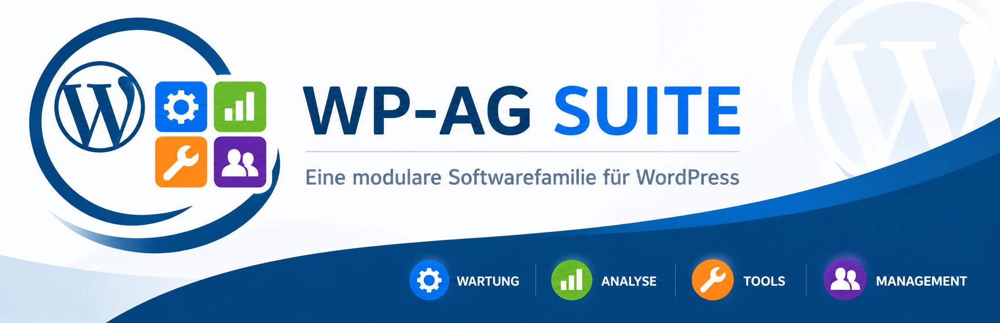
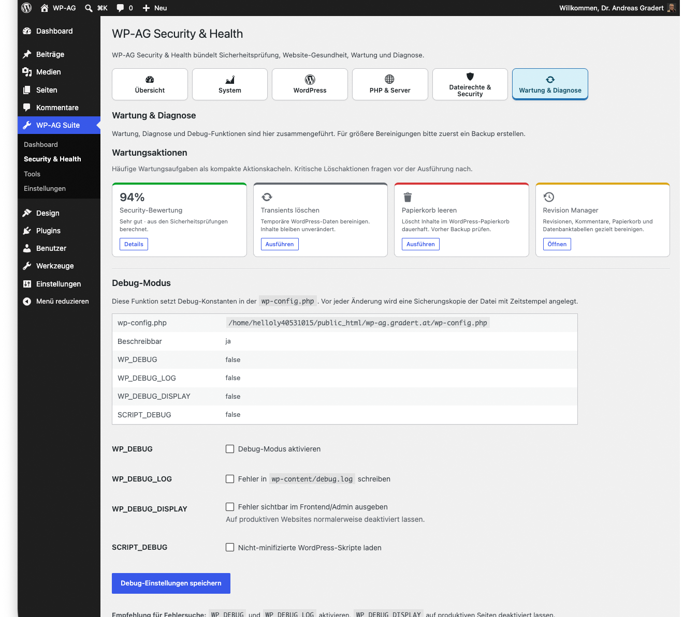
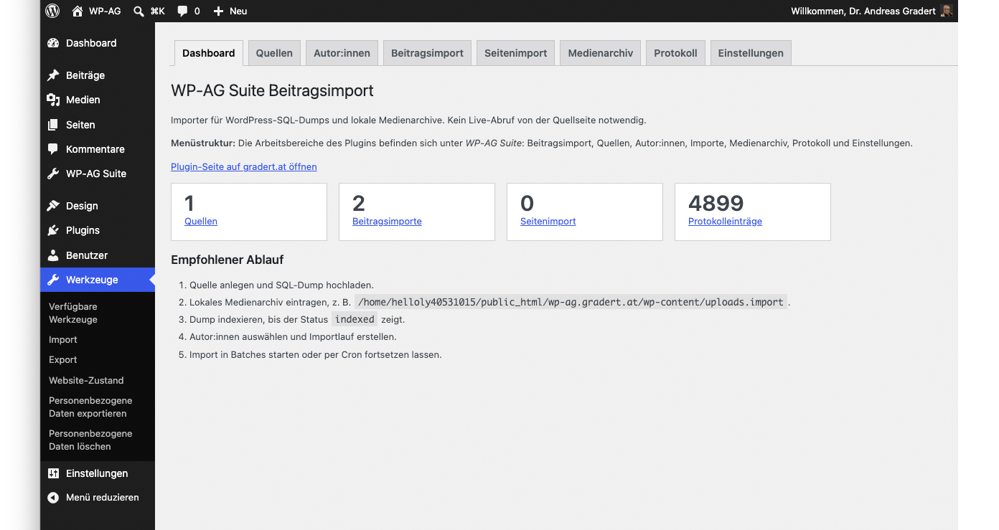
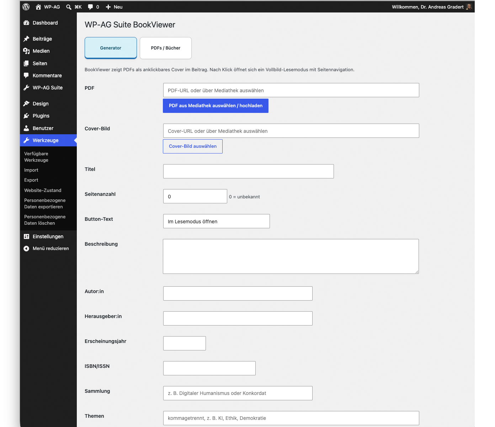
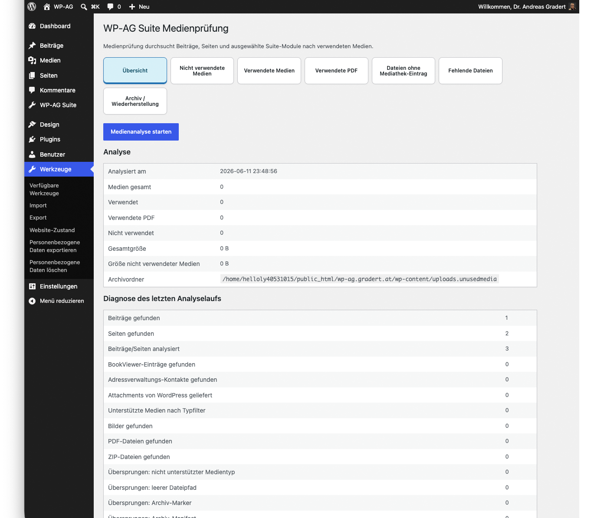
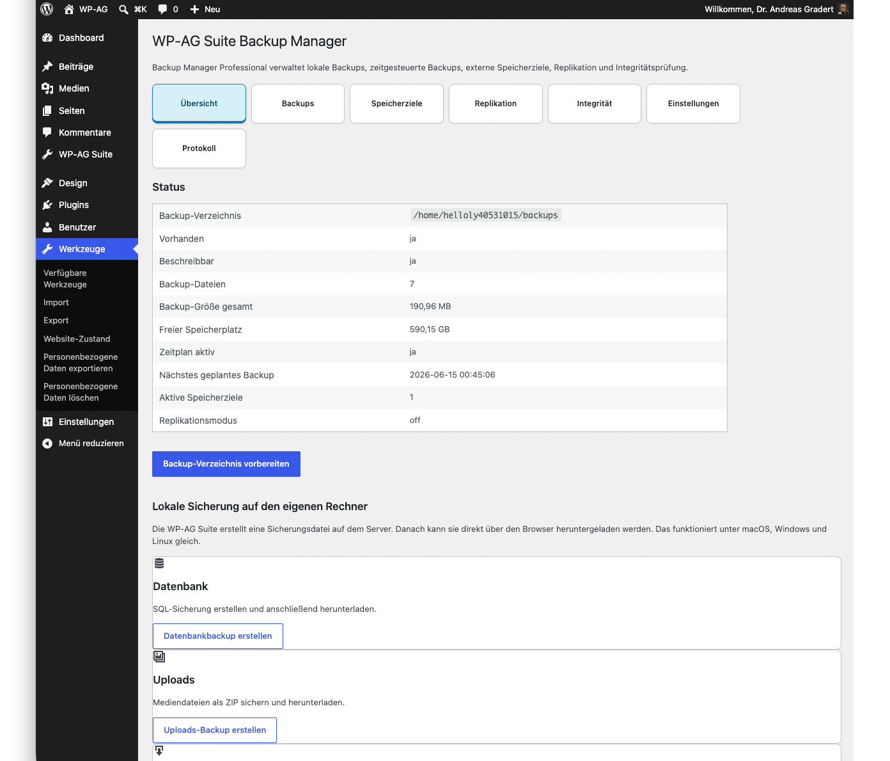
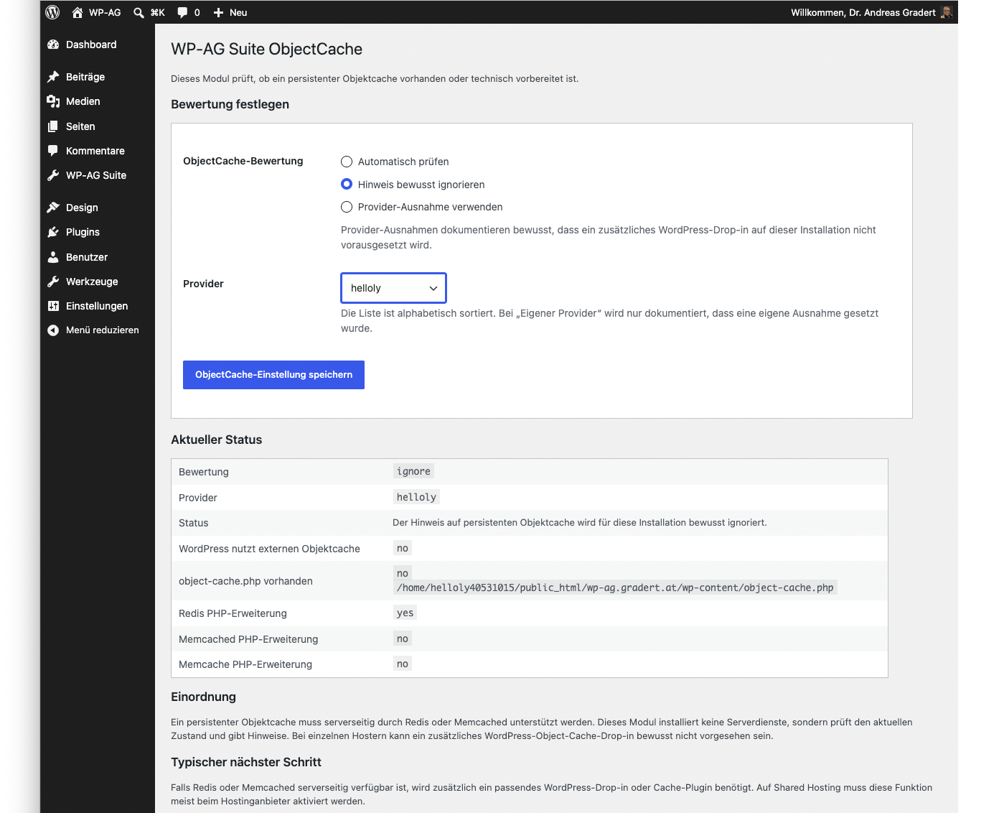
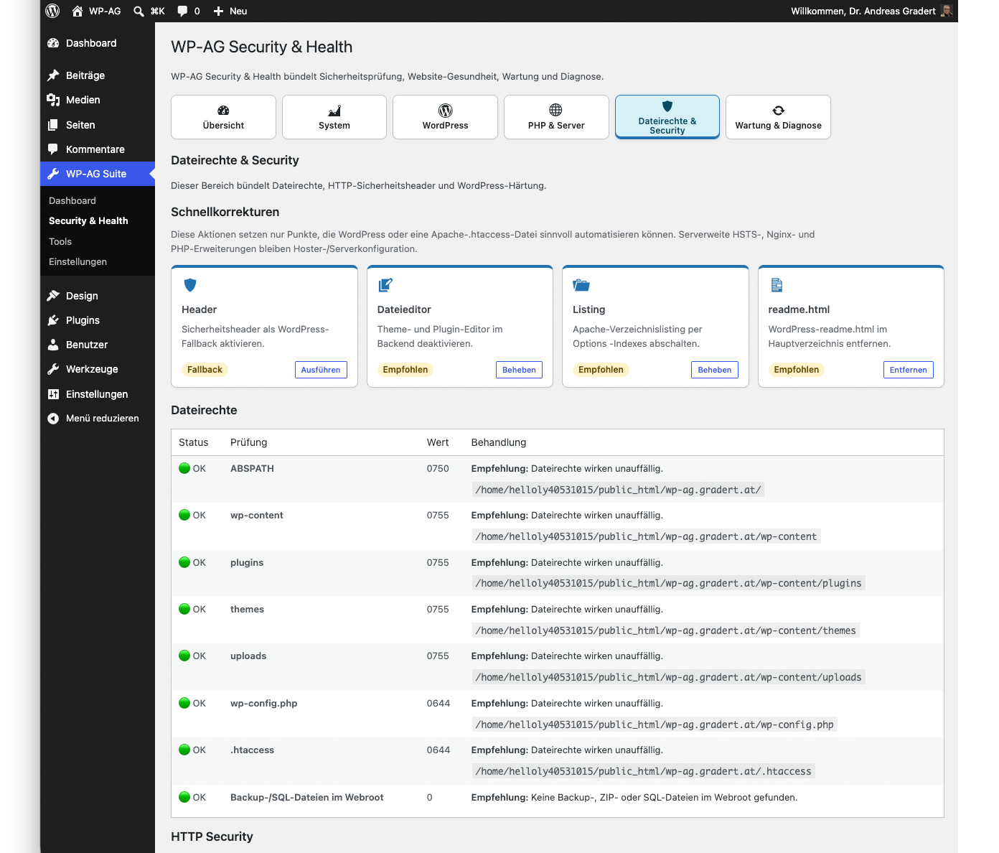

# WP-AG Suite

> Aktuelle Version: 2.3.7
>
> Kostenfrei, Open Source und in aktiver Entwicklung.

## Screenshots

### Dashboard

### Diagnose

### Beitragsimport

### BookViewer

### MediaInspector

### BackupManager

### ObjectCache Analyse

### BackupManager

### Security Check

## Modulare Werkzeuge für WordPress

WP-AG Suite ist eine modulare Open-Source-Werkzeugsammlung für WordPress. Das Projekt bündelt Diagnose, Sicherheit, Migration, Medienverwaltung, Dokumentenverwaltung, Qualitätskontrolle und administrative Werkzeuge in einer gemeinsamen Oberfläche.

Die Suite richtet sich an Website-Betreiber, Vereine, NGOs, Bildungseinrichtungen, Administratoren, Agenturen und Entwickler, die WordPress professioneller, transparenter und wartbarer betreiben möchten.

## Warum WP-AG Suite?

Viele WordPress-Websites verwenden im Laufe der Zeit eine Vielzahl einzelner Plugins unterschiedlicher Hersteller. Jedes Plugin löst zwar ein konkretes Problem, bringt aber eigene Bedienkonzepte, Einstellungen, Abhängigkeiten und Updatezyklen mit sich. Mit zunehmender Anzahl installierter Erweiterungen steigen Wartungsaufwand, Komplexität und das Risiko von Inkompatibilitäten.

Gerade Administratoren, Vereine, NGOs, Agenturen und Betreiber größerer Websites wünschen sich häufig eine einheitlichere Lösung für wiederkehrende Aufgaben wie Diagnose, Migration, Medienverwaltung, Dokumentenmanagement oder Qualitätskontrolle.

WP-AG Suite entstand aus dem Wunsch, häufig benötigte Werkzeuge in einer gemeinsamen Umgebung zusammenzuführen und damit die Verwaltung von WordPress-Websites einfacher, transparenter und konsistenter zu gestalten.

## Grundidee

WP-AG Suite verfolgt einen modularen Ansatz. Anstatt viele voneinander unabhängige Einzelplugins zu installieren, werden verschiedene Werkzeuge unter einer gemeinsamen Oberfläche zusammengeführt. Die einzelnen Module bleiben unabhängig nutzbar, folgen jedoch denselben Bedienkonzepten und arbeiten nahtlos zusammen.

Das bedeutet:

- Eine gemeinsame und konsistente Benutzeroberfläche
- Modulare Werkzeuge mit zentraler Verwaltung
- Einheitliche Bedienkonzepte über alle Module hinweg
- Lokale Datenverarbeitung, wo immer möglich
- Datenschutzfreundliche Architektur
- WordPress-konforme Umsetzung
- Transparente Entwicklung und nachvollziehbare Funktionen
- Kostenfreie Bereitstellung als Open-Source-Projekt

Ziel ist nicht, möglichst viele Funktionen in einem Plugin zu bündeln, sondern eine zusammenhängende Werkzeugplattform bereitzustellen, die typische Aufgaben rund um WordPress effizient und nachvollziehbar unterstützt.

## Projektstatus

WP-AG Suite befindet sich in aktiver Entwicklung und wird kontinuierlich erweitert.

Aktuelle Version: 2.3.7

Der Schwerpunkt der kommenden Versionen liegt auf Migration, Medienverwaltung, Performanceanalyse, Diagnostik und der weiteren Vereinheitlichung der Benutzeroberfläche. Neue Funktionen und geplante Erweiterungen werden in der ROADMAP.md dokumentiert.

## Download

Die aktuelle Version kann über die GitHub Releases heruntergeladen werden.

https://github.com/nutzhirn/WP-AG-Suite/releases

## Features

### Website-Diagnose & Analyse

- Analyse der WordPress-Installation
- PHP- und Serverinformationen
- Systemstatus auf einen Blick
- Erkennung häufiger Konfigurationsprobleme
- Website-Gesundheitsprüfung
- Objekt-Cache-Analyse
- Fehler- und Warnhinweise

### Sicherheit

- Sicherheitsprüfung der WordPress-Installation
- Erkennung typischer Sicherheitsrisiken
- Hinweise zu Härtungsmaßnahmen
- Sicherheitsrelevante Konfigurationskontrolle

### Migration & Import

- Beitragsimport zwischen WordPress-Installationen
- Autoren-Mapping beim Import
- Medienimport
- Duplikaterkennung
- Importprotokolle
- Vorbereitung für Seitenimport
- Vorbereitung für Kommentarmigration
- Vorbereitung für vollständige Website-Migrationen

### Medienverwaltung

- Analyse der Mediathek
- Erkennung nicht verwendeter Medien
- Archivierung ungenutzter Dateien
- Wiederherstellung archivierter Medien
- Verwaltung großer Medienbestände

### Dokumentenverwaltung

- PDF-Verwaltung
- BookViewer-Integration
- Digitale Dokumentenbibliotheken
- Dokumentenvorschau
- Thematische Dokumentensammlungen

### Inhalte & Redaktion

- Artikelarchiv-Funktionen
- Erweiterte Beitragswerkzeuge
- Revisionsverwaltung
- Content-Management-Hilfen
- Redaktionelle Unterstützung

### Backup & Wartung

- Backup-Unterstützung
- Wartungswerkzeuge
- Bereinigungsfunktionen
- Analyse technischer Altlasten
- Theme- und Systempflege

### Benutzerfreundlichkeit

- Einheitliche Benutzeroberfläche
- Modulare Architektur
- Zentrale Modulverwaltung
- Konsistente Bedienkonzepte
- Übersichtliches Dashboard

### Performance

- Objekt-Cache-Analyse
- Performance-Hinweise
- Optimierungsempfehlungen
- Vorbereitung für erweitertes Performance-Monitoring

### Datenschutz & Transparenz

- Lokale Datenverarbeitung, wo immer möglich
- Datenschutzfreundliche Architektur
- Open-Source-Entwicklung
- Transparente Funktionsweise
- WordPress-konforme Umsetzung

## Besonderheiten

- Modulare Architektur
- Lokale Datenverarbeitung
- Datenschutzfreundlicher Ansatz
- Kostenfrei und Open Source
- Fokus auf Vereine, NGOs und Bildungsprojekte
- Einfache Bedienung
- Einheitliche Oberfläche statt vieler Einzelplugins

## Zielgruppen

- Website-Betreiber
- Vereine und NGOs
- Bildungseinrichtungen
- Administratoren
- Agenturen
- Entwickler
- WordPress-Power-User

## Aktuelle Module

- Dashboard
- Diagnose
- Security Check
- Beitragsimport
- BookViewer
- MediaInspector
- BackupManager
- Contacts
- PostTools
- RevisionManager
- FontForce
- MenuSearch
- KatCloud
- Artikelarchiv
- ThemeCleaner
- Object Cache Analyse

## Geplante Erweiterungen

Die Roadmap umfasst unter anderem Seitenimport, erweiterte Migration, Kommentarimport, PDF-zu-BookViewer-Konvertierung, Avatar-Modul, Bildhandling, Akkordeon Generator, Image Resizer, Child Theme Generator, Activity Log / Audit Log, Adressverwaltung, Socializer, Performance & Diagnostics Center und einen Website Quality Report.

## Installation

1. ZIP-Datei herunterladen
2. In WordPress unter Plugins hochladen
3. Plugin aktivieren
4. Gewünschte Module aktivieren
5. WP-AG Suite im Admin-Menü öffnen

## WP-AG Plattform

WP-AG ist als Plattformfamilie gedacht:

- WP-AG Suite: WordPress-Werkzeuge.
- WP-AG Trial: Verwaltung von Border-Collie-Trials und Hütehundveranstaltungen.
- WP-AG Verein: Vereins- und NGO-Verwaltung.
- WP-AG Developer: Werkzeuge für Agenturen, Entwickler und Administratoren.

## Roadmap

Die geplante Weiterentwicklung ist in der ROADMAP.md dokumentiert.

Geplante Module:

- Image Resizer
- Child Theme Generator
- Activity Log
- Performance & Diagnostics Center
- Adressverwaltung
- Socialiser

## Voraussetzungen

- WordPress 6.x
- PHP 8.0 oder höher
- Administratorrechte

## Kontakt & Support

Fragen, Fehlerberichte und Verbesserungsvorschläge:

plugins@gradert.at

Bugreports und Feature-Wünsche können per Mail oder direkt über GitHub Issues eingereicht werden.

## Lizenz

WP-AG Suite wird als Open-Source-Software unter der GPL-2.0-or-later veröffentlicht.
