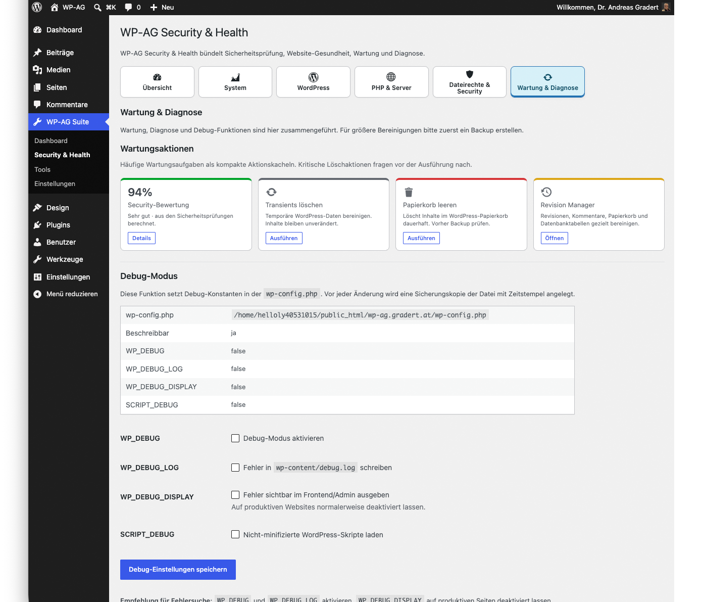

# WP-AG Suite

> WP-AG Suite ist eine modulare Open-Source-Werkzeugsammlung für WordPress

## Dashboard

## Modulare Werkzeuge für WordPress

WP-AG Suite ist eine modulare Open-Source-Werkzeugsammlung für WordPress. Das Projekt bündelt Diagnose, Sicherheit, Migration, Medienverwaltung, Dokumentenverwaltung, Qualitätskontrolle und administrative Werkzeuge in einer gemeinsamen Oberfläche.

Die Suite richtet sich an Website-Betreiber, Vereine, NGOs, Bildungseinrichtungen, Administratoren, Agenturen und Entwickler, die WordPress professioneller, transparenter und wartbarer betreiben möchten.

## Grundidee

Viele WordPress-Websites verwenden eine Vielzahl einzelner Plugins für Aufgaben, die organisatorisch zusammengehören. Dadurch entstehen unterschiedliche Bedienkonzepte, Abhängigkeiten, Wartungsaufwand und zusätzliche Risiken.

WP-AG Suite verfolgt einen anderen Ansatz:

- Eine gemeinsame Oberfläche.
- Modulare Werkzeuge.
- Transparente Entwicklung.
- Lokale Datenverarbeitung, wo immer möglich.
- Datenschutzfreundliche Architektur.
- WordPress-konforme Umsetzung.
- Kostenfreie Bereitstellung als Open-Source-Projekt.

## Aktuelle Module

- Dashboard
- Diagnose
- Security Check
- Beitragsimport
- BookViewer
- MediaInspector
- BackupManager
- Contacts
- PostTools
- RevisionManager
- FontForce
- MenuSearch
- KatCloud
- Artikelarchiv
- ThemeCleaner
- Object Cache Analyse

## Geplante Erweiterungen

Die Roadmap umfasst unter anderem Seitenimport, erweiterte Migration, Kommentarimport, PDF-zu-BookViewer-Konvertierung, Avatar-Modul, Bildhandling, Akkordeon Generator, Image Resizer, Child Theme Generator, Activity Log / Audit Log, Adressverwaltung, Socializer, Performance & Diagnostics Center und einen Website Quality Report.

## WP-AG Plattform

WP-AG ist als Plattformfamilie gedacht:

- WP-AG Suite: WordPress-Werkzeuge.
- WP-AG Trial: Verwaltung von Border-Collie-Trials und Hütehundveranstaltungen.
- WP-AG Verein: Vereins- und NGO-Verwaltung.
- WP-AG Developer: Werkzeuge für Agenturen, Entwickler und Administratoren.

## Lizenz

GPL-2.0-or-later
